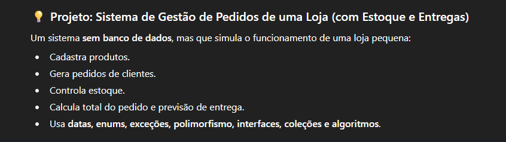

# Projetos para estudos.

## 🚦 CityFlow - Simulador de Tráfego Urbano

O Simulador de Tráfego Urbano (CityFlow) é um dos temas mais ricos pra estudar Java, porque permite aplicar POO, exceções, threads, polimorfismo, classes utilitárias, datas, IO e até deadlocks, tudo de forma orgânica e divertida.

#### 🧠 Conceito Geral

O sistema CityFlow simula o tráfego de uma cidade. Os veículos (carros, motos, ônibus, caminhões) são threads que circulam pelas vias e cruzamentos. Os semáforos controlam o fluxo e são compartilhados entre threads, permitindo estudar concorrência, sincronização e deadlocks.

## SISTEMA GESTÃO DE PEDIDOS

## Mini iFood - Projeto POO Java

Projeto individual focado em utilitários para sistemas: validadores (CPF, CNPJ, email, senha), calculadoras (pedidos, descontos, valores mínimos) e formatadores (moeda, data, documentos). Implemente 15 classes práticas aplicando POO pura, com métodos estáticos e regras de negócio reais. Ideal para aprender Java através de componentes essenciais de qualquer aplicação comercial.

## Eternal Idle 

🎮 Eternal Idle - RPG Incremental
Eternal Idle é um jogo RPG incremental desenvolvido em Java com JavaFX. Os jogadores enfrentam monstros em combate automático, coletam equipamentos raros e evoluem suas habilidades em uma progressão contínua. O sistema inclui inventário visual, árvore de habilidades, loja, crafting e sistema de equipamentos completo.

🛠️ Tecnologias
Java com JavaFX para interface gráfica

Sistema de equipamentos (armas, armaduras, luvas, botas)

Inventário e stash para gerenciamento de itens

Progressão automática com combate idle

Sistema de raridade e drops de monstros

🎯 Características
Combate automático, evolução de personagem, coleta de equipamentos e desafios progressivos em uma experiência RPG incremental envolvente!

(em desenvolvimento)

## Desafio PROGRAMAÇÃO - Sistema de Cadastros 🚀

#### Objetivo
Neste desafio, você será desafiado a criar um sistema de cadastro via CLI (interface de linha de comando), para nossos futuros adotantes poderem escolher o seu animalzinho.

O dono do abrigo de animais que será o usuário do seu programa será capaz de:

- Cadastrar um novo pet
- Buscar dados do pet cadastrado
- Deletar um pet cadastrado
- Listar todos os pets cadastrados
- Listar pets por algum critério (idade, nome, raça)
- E muito mais!

O sistema deve ser implementado utilizando conceitos de Orientação a Objetos e outras boas práticas de programação. 🚀

#### Conhecimentos que você irá aplicar:
- Orientação a Objetos (OO)
- Manipulação de arquivos e arrays
- Java IO
- Exceções
- Boas práticas de código
- File Systems