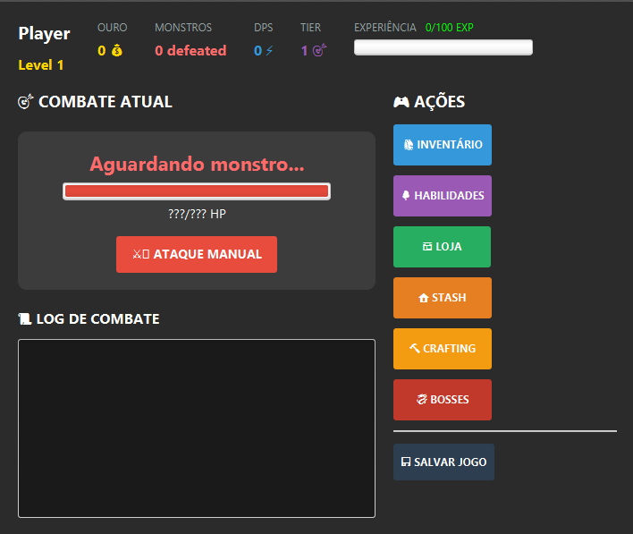

🎮 Eternal Idle - RPG Incremental
Eternal Idle é um jogo RPG incremental desenvolvido em Java com JavaFX. Os jogadores enfrentam monstros em combate automático, coletam equipamentos raros e evoluem suas habilidades em uma progressão contínua. O sistema inclui inventário visual, árvore de habilidades, loja, crafting e sistema de equipamentos completo.

🛠️ Tecnologias
Java com JavaFX para interface gráfica

Sistema de equipamentos (armas, armaduras, luvas, botas)

Inventário e stash para gerenciamento de itens

Progressão automática com combate idle

Sistema de raridade e drops de monstros

🎯 Características
Combate automático, evolução de personagem, coleta de equipamentos e desafios progressivos em uma experiência RPG incremental envolvente!

